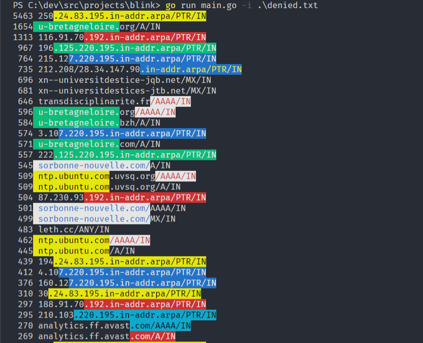

# Blink

`blink` is a cli wich purpose is to find common patterns from stdin or a file, and print them in color, or just identify these patterns. The pattern extraction can be made from a list of separators, or caracters by caracters (very slow on long lines).

## Getting Started

`blink` is using standard flags from golang :

```
  -P    only print found patterns
  -S string
        use separators "space+  ,;/" [default char]
  -T    no time limit
  -i string
        input [default:sdtin]
  -l int
        min pattern length (default 7)
  -o int
        min occurences (default 3)
```



### Prerequisites

`blink` is written in golang, so building will requisite you to install golang.
github.com/fatih/color is mandatory

```
go get github.com/fatih/color
```

### Installing

```
 go get github.com/thc2cat/blink
 go install
```

## Running the tests

There is a few tests ( written after coding , my bad. )

## Deployment

go build, go install

## Built With

* [fatih/color] http://github.com/fatih/color

## Contributing

Please read, fork and PR

## Authors

* **thc2cat** - *Initial work* 

## License (later)

This project is licensed under the MIT License - see the [LICENSE.md](LICENSE.md) file for details

## Acknowledgments

* Hat tip to anyone who's code was used
* Inspiration
* etc
